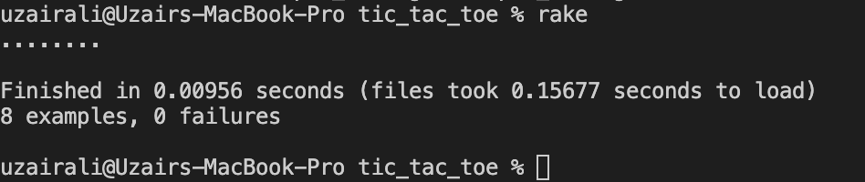

# Tic Tac Toe ⚪ ⚔️

Tic-tac-toe, noughts and crosses, is a paper-and-pencil game for two players, X and O, who take turns marking the spaces in a 3×3 grid. The player who succeeds in placing three of their marks in a diagonal, horizontal, or vertical row is the winner. It is a solved game with a forced draw assuming best play from both players.

## Strategy

A player can play a perfect game of tic-tac-toe (to win or at least draw) if, each time it is their turn to play, they choose the first available move from the following list, as used in Newell and Simon's 1972 tic-tac-toe program.

- Win: If the player has two in a row, they can place a third to get three in a row.
- Block: If the opponent has two in a row, the player must play the third themselves to block the opponent.
- Fork: Create an opportunity where the player has two ways to win (two non-blocked lines of 2).
- Blocking an opponent's fork: If there is only one possible fork for the opponent, the player should block it. Otherwise, the player should block all forks in any way that simultaneously allows them to create two in a row. Otherwise, the player should create a two in a row to force the opponent into defending, as long as it doesn't result in them creating a fork. For example, if "X" has two opposite corners and "O" has the center, "O" must not play a corner move in order to win. (Playing a corner move in this scenario creates a fork for "X" to win.)
- Center: A player marks the center. (If it is the first move of the game, playing a corner move gives the second player more opportunities to make a mistake and may therefore be the better choice; however, it makes no difference between perfect players.)
- Opposite corner: If the opponent is in the corner, the player plays the opposite corner.
- Empty corner: The player plays in a corner square.
- Empty side: The player plays in a middle square on any of the 4 sides.

## Demo

## Technologies Used

- Ruby

## Authors

👤 **Uzair**

- LinkedIn: [LinkedIn](https://www.linkedin.com/in/uzair-ali-964187166/)
- GitHub: [@githubhandle](https://github.com/uzairali19)

## Getting Started

To play the game, please setup the project from the description below. Once you are done:

1. Type the name of 1st Player
2. Type the name of 2nd Player
   (Notice first player always get's 'X' and second player gets 'O', So, feel free to switch!)
3. Try to create a winning combination
4. Both players take turns, think of a strategy.
5. Once you complete and the game `Draws`. Restart and try again.

### Setup Local

To get a local copy of this project follow the steps below:

Use `git clone https://github.com/uzairali19/tic_tac_toe.git` to clone the branch directly to your machine

### Setting up linter

### [RuboCop](https://docs.rubocop.org/en/stable/)

1. Run `bundle install`.
2. Run `rubocop`.
3. Fix linter errors.
4. **IMPORTANT NOTE**: feel free to research [auto-correct options for Rubocop](https://rubocop.readthedocs.io/en/latest/auto_correct/) if you get a flood of errors but keep in mind that correcting style errors manually will help you to make a habit of writing a clean code!

- Navigate the project, you can open it with VScode or any other code editor of choice
- run the code by opening up your terminal and typing:
- `ruby bin/main.rb`
- Happy coding!

### Using Rspec to test

1. Run `bundle install`.
2. Run `Rake`.
3. See the spec log on the console to check the results.

#### Example

## 🤝 Contributing

Contributions, issues, and feature requests are welcome!

Feel free to check the [issues page](https://github.com/uzairali19/tic_tac_toe/issues).

## Show your support

Give a ⭐️ if you like this project!

## 📝 License

This project is copyright protected, Feel free to contact the authors to collaborate.
